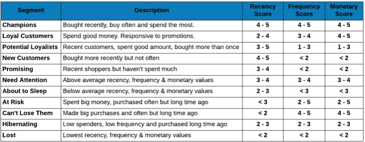

```{r setup, include=FALSE}
knitr::opts_chunk$set(echo = TRUE)
```

## 1.0 Introdução

A segmentação de clientes pode ser realizada usando diversas características do cliente. As mais comuns são região geográfica, dados demográficos (por exemplo, idade, sexo, estado civil, renda), psicografia (por exemplo, valores, interesses, estilo de vida, afiliações de grupos) e comportamento de compra (por exemplo, compras anteriores, preferências de envio, visualizações de página em seu site etc.).

A **análise RFM (Recency, Frequency & Monetary)** é uma técnica baseada no perfil e hábitos de compras do consumidor com o objectivo de segmentar os clientes avaliando o histórico de suas transações, tais como: 
a) há quanto tempo o cliente efectuou uma compra ou qual foi a última vez que o cliente fez uma compra? 
b) com que frequência faz as compras? 
c) quanto o cliente gasta (valor monetário)? 

Este conceito é baseado no axioma de marketing de que **80% da sua receita provém de 20% de seus clientes**. Assim, **RFM** ajuda a identificar clientes com maior probabilidade de responder à promoções segmentando-as em várias categórias. 


## 2.0 Contextualização
No presente trabalho foi usado o seguinte *dataset* , https://www.coursera.org/learn/foundations-marketing-analytics/supplement/M8mWk/r-files-and-dataset, extraido do curso "Foundations of marketing analytics" por by ESSEC Business School para efeitos de mera demonstração. Trata-se de um ficheiro contendo registo de compras efectuadas por clientes entre os anos de 2005 e 2015. Não está claro se os dados são verdadeiros ou simulados. Porém, encorajo o uso da *técnica RFM* para dados em produção. 

Pretendo com este *Post* partilhar a minha experiência na aplicação dessa técnica na industria de *telecom* e por razões óbvias não vou compartilhar convosco os dados em produção mas os procedimentos para que vocês possam reproduzir nos vossos ambientes de produção. 

Estavamos num contexto onde não conheciamos o nosso cliente e nem sabíamos se um determinado cliente era relevante ou não para a nossa organização. Em outras palavras, procuravamos responder as seguintes questões: 
a) **quem são os nossos clientes mais valioso?**  
b) **como podemos adquirir novos clientes que se assemelham aos nossos (clientes) mais valiosos**.

Portanto, o nosso objectivo principal visava analisar o comportamento e hábitos de consumo dos clientes para classifica-los e segmenta-los em diferentes grupos. E como objectivo específicos: 
1. identificar quais são nossos clientes mais/menos valiosos; 
2. identificar os clientes que podem contribuir para a taxa de desistência ou abandono (churn rate);
3. identificar os potenciais clientes valiosos; 
4. identificar os clientes que podem ser retidos; 
5. saber quanto valor um cliente está a gerar para a organização; 
6. saber como o valor gerado vai evoluir; 
7. segmentar os clientes com base no seu valor;e 
8. monitorar a migração ou a movimentação dos clientes entre os segmentos definidos. 

Isso porque, pretendiamos executar acções específicas para diferentes grupos de clientes. Por isso, precisavamos de encontrar uma maneira de segmentar a nossa base de clientes em grupos com base em seu valor para os negócios.

### 2.1 Metodologia
Para alcançar os objectivos propostos usamos os dados históricos (transações) sobre os recarregamentos (compra de recargas que o habilita a realizar uma chamada ou operação) efectuados pelos clientes pré-pagos nos últimos 02 (dois) anos.
As ferramentas usadas para análise de dados foram o **R e o IDE RStudio**. 


## 3.0 Caso de Estudo
Normalmente, a análise RFM obdece os seguintes passos: 
1. Coleccionar os dados transacionais; 
2. Agregar os dados por cliente; 
3. Calcular os RFM scores; 
4. Definir a segmentação dos clientes. 

### 3.1 Análise Descritiva de Dados
É sempre recomendável o uso de Análise Descritiva de Dados para se familiazar e uma melhor compreensão de dados antes de avançar com qualquer que seja à análise.

Portanto, vamos proceder com o carregamento e leitura dos dados em R:

```{r}
# __________________________________________________________
# //////////////////////////////////////////////////////////
#
#    Customer Segmentation using RFM score
# __________________________________________________________
# //////////////////////////////////////////////////////////


# 1.0 --- EXPLORE THE DATA -------------------------------------
library(tidyverse)
library(pander) # for aesthetics

library(highcharter)

# Load text file into local variable called 'data'
transaction_dat <-
    read.delim(
        file = 'data/purchases_transactions.txt',
        header = FALSE,
        sep = '\t',
        dec = '.'
    )

# Display what has been loaded

# transaction_dat %>% glimpse()
pander(head(transaction_dat))

```

Vamos adicionar o cabeçalho e tomamos o dia de **01/01/2016** como sendo a data de referência para a análise.

```{r}
# Add headers and interpret the last column as a date, extract year of purchase
colnames(transaction_dat) <-
    c('customer_id', 'purchase_amount', 'date_of_purchase')

# convert to date
transaction_dat$date_of_purchase <-
    as.Date(transaction_dat$date_of_purchase, "%Y-%m-%d")

# date_of_analysis
date_of_analysis <- as.Date('2016-01-01')

transaction_dat$days_since <- as.numeric(
    difftime(
        time1 = date_of_analysis,
        time2 = transaction_dat$date_of_purchase,
        units = "days"
    )
)

# Display the data set after transformation
head(transaction_dat) %>% pander()
```

Vamos usar o código SQL para agregar os dados por clientes.
```{r}
# 1.1 Compute key marketing indicators using SQL language -----------------------------
library(sqldf)

# Compute recency, frequency, and average purchase amount
customers_dat = sqldf(
    "SELECT customer_id,
            MIN(days_since) AS 'recency',
            MAX (days_since) AS first_purchase,
            COUNT(*) AS 'frequency',
            SUM(purchase_amount) AS 'monetary'
        FROM transaction_dat
        GROUP BY 1"
)

head(customers_dat) %>% pander()
```

Sumarizando os dados temos o seguinte resultado:
```{r}
summary(customers_dat) %>% pander()
```

Para avaliar a distribuição dos parâmetros RFM podemos usar o histograma.
```{r}
hist(customers_dat$recency)
hist(customers_dat$frequency)
hist(customers_dat$monetary)
hist(customers_dat$monetary, breaks = 50)
```

#### 3.1.1 Determinar Percentil
Para determinar os parâmetros RFM usa-se os quartis ou percentis. Nós vamos dividir o conjunto de dados em $05$ partes iguais, ou seja divisão em $20$% cada parte. A ideia é encontrar os **Top** $20$% **clientes** mais valiosos fazendo jus a lei de pareto **80/20**.
```{r}
quantile(customers_dat$monetary, probs = seq(0, 1, 0.20)) %>% pander()
```

O output mostra o seguinte: 
- os clientes **Top20** gastam em média mais de $190.00$ u.m (unidade monetária);
- os $20$% seguintes gastam entre $85.00$ e $190.00$ u.m,
enquanto que os últimos $20$% dos clientes gastam menos de $30.00$ u.m em seu consumo médio.


```{r}
quantile(customers_dat$frequency, probs = seq(0, 1, 0.20)) %>% pander()
```

Quanto à frequência com que fazem as compras, podemos observar que: 
- os **clientes Top20** compraram mais de $4$ vezes ao longo dos 10 anos do periódo em análise; 
- os seguintes $20$% dos clientes compraram entre $2$ e $4$ vezes; 
- os últimos $20$% dos clientes compraram $01$ no periódo em análise. 

```{r}
quantile(customers_dat$recency, probs = seq(0, 1, 0.20)) %>% pander()
```

E finalmente analisamos a actividade mais recente para cada cliente. Para esse parâmetro em particular *recency*, a ordem de classificação é inversa, ou seja os **Top20 clientes** são os primeiros $20$% do percentil. Portanto, o output mostra que: 
- os Top20 clientes compraram nos últimos $108$ dias; 
- os próximos $20$% de clientes compraram no intervalo entre $108$ e $731$ dias; 
- ao passo que os últimos $20$% de clientes ficam mais de $4000$ dias sem efectuar nenhum compra, isto é a sua última compra foi há 10 anos atrás.


### 3.2 Determinar RFM score
Para determinar os *RFM score*, vamos usar o percentil $20$ (P20), isto é dividir a série de dados em $05$ partes iguais. Em outras palavras, isso significa que os **Top20** ficam com pontuação máxima de $05$ pontos, enquanto que os últimos $20$% ficam com a pontuação mínima de $01$ ponto. 
Caso particular, vai para o **parâmetro R (recency)**, onde a ordem deve ser invertida, isto é os valores baixos levam pontuação máxima ($05$ pontos) e os valores altos pontuação minima ($01$ ponto). 

Portanto, o melhor cliente tem a pontuação máxima de $555$ *(RFM score)* e o pior com pontuação mínima de $111$ *(RFM score)* pontos. 

Em **código R** pode ser implementado do seguinte modo:
```{r}
 
# Calculating RFM score

rfm_data <- customers_dat

# RFM Score
rfm_data <-
    rfm_data %>%
    mutate(
        R = ntile(desc(recency), 5),
        F = ntile(frequency, 5),
        M = ntile(monetary, 5)
    )

rfm_data$RFM <- rfm_data$R * 100 + rfm_data$F * 10 + rfm_data$M

rfm_data %>% head(10) %>% pander()
```

Note que, os clientes com elevado *RFM score* apresentam valores baixos para variável $RECENCY$ e a altos para as variáveis $FREQUENCY$ e $MONETARY$, por exemplo *Customer_id = 80*, enquanto que os clientes com baixo *RFM score*, mostram altos valores para a variável $RECENCY$ e baixos para $FREQUENCY$.
Contudo, para clientes com valores *RFM score intermédios* precisam de uma análise mais cuidadosa. Como será verificado a seguir.


### 3.3 Definir a segmentação dos clientes
A segmentação dos clientes é feita com base no *RFM score*. Por isso, precisamos cuidadosamente de definir e analisar os intervalos dos *RFM scores*. Assegurando a não duplicação dos clientes em vários segmentos, ou seja cada cliente pertence exclusivamente a um único segmento.

Como podem ter constatado essa abordagem gera $125$ segmentos se considerarmos cada *RFM score* individualmente como sendo um segmento. O que tornaria o processo muito dificil de analisar. 

De um modo geral, o parâmetro $MONETARY$ é visto como uma métrica agregadora para sumarizar as transações. Assim, dos $125$ segmentos (RFM score) podem ser reduzidos para $25$ segmentos apenas usando os parâmetros $RECENCY$ e $FREQUENCY$. Ademais, se fizermos a combinação destes $25$ podemos alcançar segmentos mais manejáveis e intuitivos, reduzindo deste modo para $6-8$ segmentos.

Está foi a fase mais delicada de todo o processo. Encontrar um critério para definir a segmentação de clientes que faça sentido para o seu negócio. Alguns artigos sugerem a definição dos segmentos com base no bom senso e na natureza do negócio. Então, tentei encontrar um critério que fosse geral, independentemente da natureza do negócio. Com ajuda, da *Tabela 1* defini os segmentos usando o seguinte critério:

```{r}

# Define Customer Segmentation Groups
rfm_data$segment <- NA

rfm_data$segment[which(rfm_data$RFM == 111)] <- 'Lost'
rfm_data$segment[which(rfm_data$RFM > 111)] <- 'Hibernating'

rfm_data$segment[which(rfm_data$RFM >= 222)] <- 'About to Sleep'

rfm_data$segment[which(rfm_data$RFM >= 333)] <-
    'Potential Loyalists'

rfm_data$segment[which(rfm_data$RFM >= 444)] <- 'Champions'


# 2nd round

rfm_data$segment[which(rfm_data$segment == 'Potential Loyalists' &
                           (rfm_data$F >= 4))] <- 'Loyal Customers'

rfm_data$segment[which(rfm_data$segment == 'About to Sleep' &
                           (rfm_data$M >= 4))] <-
    'Need Attention'

rfm_data$segment[which(rfm_data$segment == 'Hibernating' &
                           (rfm_data$F >= 4 & rfm_data$M >= 4))] <-
    'Can not Lose Them'

rfm_data$segment[which(rfm_data$first_purchase <= 180)] <-
    'New Customers'


rfm_data[, -c(3, 6,7,8)] %>% 
    head(10) %>% pander()
```

Visto que, um cliente não pode simultâneamente pertencer a mais de um segmento, ou seja deve pertencer exclusivamente a um único segmento. Então, para validar essa suposição em *código R* podemos usar a seguinte instrução:
```{r}
# validate the segments

rfm_data[is.na(rfm_data$segment), ]

# ou
# rfm_data %>%
#     filter(is.na(segment))
```
O resultado mostra que cada cliente pertence unicamente a um segmento. 




### 3.4 Distribuição dos clientes por segmentos

Precisamos de avaliar a distribuição dos clientes por segmentos. E ordena-los de uma forma que faça sentido.
```{r}
# re-order segments in factor in a wat that makes sense ----
rfm_data$segment <-
    factor(
        x = rfm_data$segment,
        levels = c(
            'Lost',
            'Hibernating',
            'Can not Lose Them',
            'About to Sleep',
            'Need Attention',
            'New Customers',
            'Potential Loyalists',
            'Loyal Customers',
            'Champions'
        )
    )


# table of frequency

freqTable <-
    rfm_data %>%
    # group_by(group) %>%
    count(segment) %>%
    # arrange(desc(n)) %>%
    rename(Segment = segment, Count = n)

freqTable %>% pander()
```
O output mostra a quantidade de clientes distribuidos pelos segmentos definidos.


Também podemos mostrar os dados agregados por segmentos.
```{r}
cust_aggr_dat <-
    aggregate(x = rfm_data[, 2:5],
              by = list(rfm_data$segment),
              mean)


cust_aggr_dat %>% pander()
```
Os resultados mostram que os clientes *Champions* $(4395)$, considerados os clientes mais valiosos gastam em média o valor de $430.00$ u.m, efectuaram compras por mais de $6$ vezes e a última compra foi em média há sensivelmente $160$ dias. Enquanto que, os *Lost* o caso pior estão há mais de $08$ anos sem efectuar uma compra. O destaque vai para o segmento *Need Attention*, uma vez que  apresentam um consumo elevado, contudo a última actividade foi há bastante tempo, ou seja há aproximadamnete $4.5$ anos. Daí que, requer um trabalho árduo para recuperá-los.


## 4.0 Visualização dos dados
Para visualizar os dados, vamos apresentar 02 tipos de gráficos: 
- *treemap* (recomendado); e 
- gráficos de barras.

### 4.1 Apresentação dos dados usando Treemap
*Treemap* é o gráfico recomendado para apresentação desse tipo de dados, ou seja dados que incluem variáveis categóricas e númericas.

```{r}
hctreemap2(
    data = freqTable,
    group_vars = "Segment",
    size_var = "Count",
    color_var = "Count"
    )

```


### 4.2 Apresentação dos dados usando gráfico de barras

```{r}
highchart() %>%
    hc_add_series(
        data = freqTable,
        type = 'column',
        hcaes(x = Segment, y = Count),
        dataLabels = list(align = "center", enabled = TRUE,
                          style = list(
                                      fontWeight = "bold",
                                      color = "#f7a35c",
                                      textOutline = NULL
                                      )
                          ),
        name = 'Segments'
    ) %>%
    hc_xAxis(categories = unique(freqTable$Segment)) %>%
    hc_yAxis(title = list(text = "No of customers"))

```

## 5.0 Conclusão

No presente *post* foi avaliado a segmentação dos clientes com base nas suas transacções históricas de compras usando à técnica *RFM score*. Foram usados dados simulados (presumo) mas a ideia é mostrar como esse processo pode ser implementado em um ambiente de produção. 

Os clientes no segmento *Champions* são considerados os mais valiosos e os *About to Sleep* e *Need Attention* precisam de alguma atenção especial para os resgatar.

Na verdade, o critério para a definição dos segmentos com base nos *RFM score* é um pouco ambíguo e requer alguma arte. Alguns autores sugerem que a definição dos segmentos depende da natureza do negócio, por isso desdobrei-me em encontrar um critério que fosse aplicável para todos casos. 
Tive sucesso aplicando esse método em produção relacionado com recarregamentos efectuado pelos subescritores nos últimos $02$ anos e encorajo sem reservas. Portanto, estou ansioso em ler vossos comentários após a adopção desta técnica.


## 6.0 Bibliográfia
1. https://www.r-bloggers.com/customer-segmentation-using-rfm-analysis/ 
2. https://www.r-bloggers.com/customer-segmentation-part-1-k-means-clustering/ 
3. https://www.putler.com/rfm-analysis/ 
4. https://blog.rsquaredacademy.com/customer-segmentation-using-rfm-analysis/ 
5. https://earlconf.com/2017/downloads/london/presentations/EARL2017_-_London_-_Alexander_Campbell_-_Customer_segmentation.pdf


